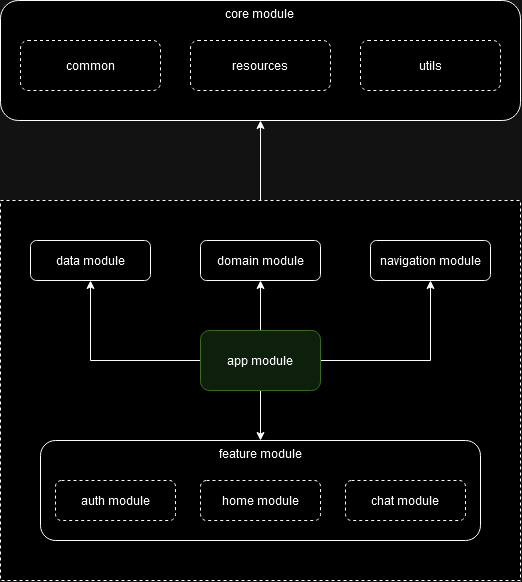

## chat-app

### stack:
- multi-module architecture
- MVVM
- dependency injection (hilt)
- firebase: auth, database, storage, messaging
- jetpack compose
- navigation compose
- kotlin flow
- kotlin coroutines

### architecture
